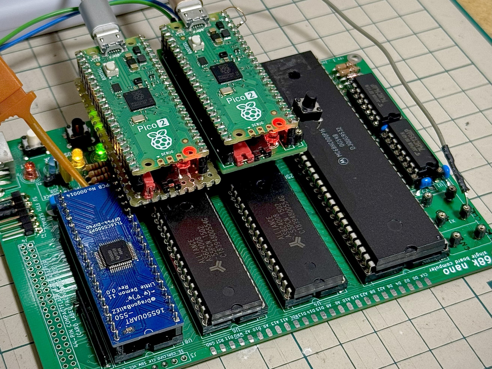
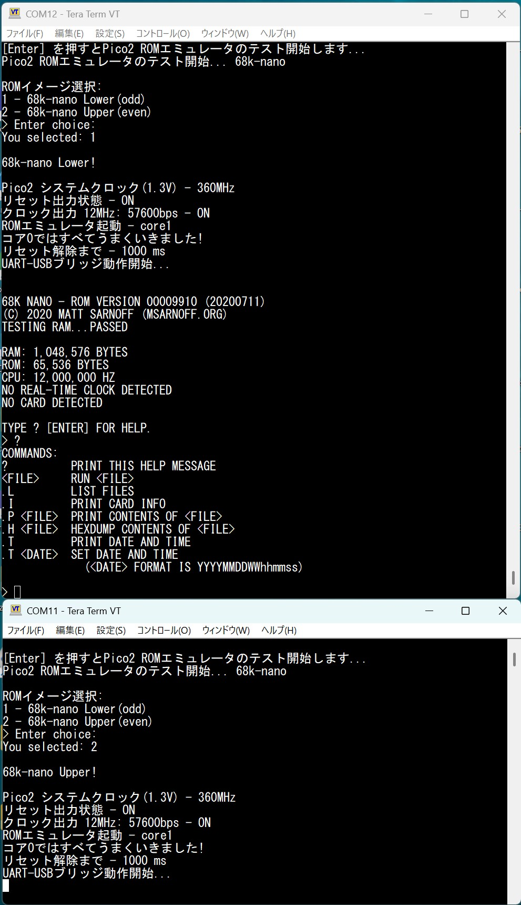

# Pico2ROMEmu 68k-nano

This project is a simple and fast ROM emulator using Raspberry Pi Pico2.
[Japanese Readme](./README.md)
## Features
- A 68k-nano 16bit (27C256 x2) MC68HC000 12MHz was operated using two Pico2ROMEmu units.
- You can select the ROM image for the Lower/Upper byte at startup.
- For more details about Pico2ROMEmu, please see [Pico2ROMEmu](https://github.com/kyo-ta04/Pico2ROMEmuBR).

## Configuration
- [68k-nano](https://github.com/74hc595/68k-nano) was created and is published by Matt Sarnoff (74hc595).
  - Forked to add ROM data, Gerber files, etc. -> [kyo-ta04: 68k-nano](https://github.com/kyo-ta04/68k-nano)

## Schematics & Documents
- 
  - The above is an example execution image.

## License
- The source code of this project is under the MIT License.
- For the ROM data parts, please refer to the licenses of the original site and the modified source.

## Disclaimer
This software is provided as is. The author is not responsible for any damages.

## Acknowledgements
- Matt Sarnoff (74hc595) ([Author of 68k-nano](https://github.com/74hc595/68k-nano))
- The developers of the Raspberry Pi Pico SDK
- Everyone involved in this project
- Please also see [Pico2ROMEmu](https://github.com/kyo-ta04/Pico2ROMEmuBR).
