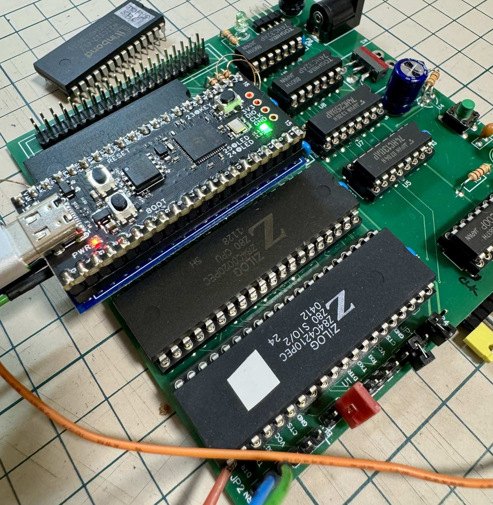
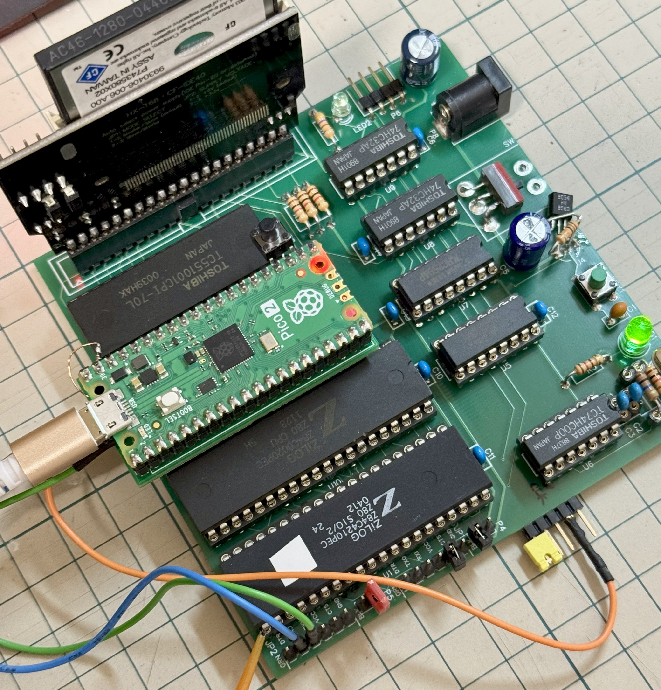
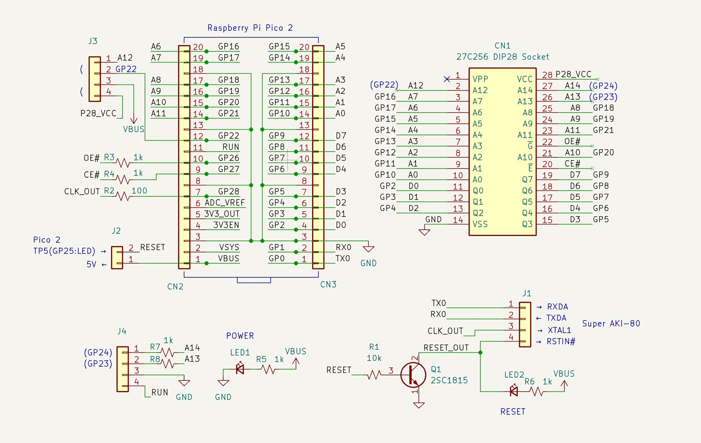
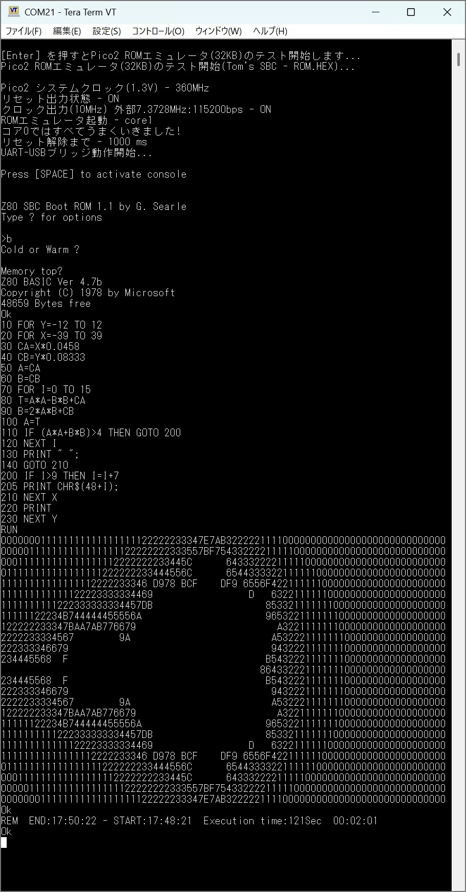

# Pico2ROMEmu 32KB - Tom's SBC 

This project is a simple and fast ROM emulator using the Raspberry Pi Pico2.
[Japanese Readme](./README.md)
## Features
- While the standard Pico2 is limited to 8KB (A0-A12) of ROM capacity due to GPIO constraints, this project expands it to 32KB (A0-A14) by modifying the Pico2 and the RP2350A_V10 CoreBoard. This allows for the emulation of larger ROM images.
- The RP2350A_V10 CoreBoard from WeAct Studio is a low-cost development board compatible with the Raspberry Pi Pico 2. It features a USB Type-C connection, additional LEDs, a reset (RUN) switch, and enhanced expandability by breaking out all GPIO pins.
Github -> [WeAct Studio RP2350A_V10 CoreBoard](https://github.com/WeActStudio/WeActStudio.RP2350ACoreBoard/tree/main/RP2350A_V10)
- For more details, please see [Pico2ROMEmu](https://github.com/kyo-ta04/Pico2ROMEmuBR).

## Configuration
- The ROM data in `rom_basic_const.c` originates from ROM.HEX, which is included in [z80sbcFiles.zip](http://searle.x10host.com/cpm/z80sbcFiles.zip) from Grant Searle's [CP/M on a breadboard](http://searle.x10host.com/cpm/index.html).

## Schematics & Documents
- Assembly instructions (note.com) 
  - [How to assemble Pico2ROMEmu](https://note.com/quiet_duck4046/n/n425d6b7e8d55?sub_rt=share_sb)
  - [How to assemble Super AKI-80 (minimal parts version)](https://note.com/quiet_duck4046/n/n32906e1dfb96?sub_rt=share_sb)  

- 
  - The image above shows an implementation example on Tom's SBC.
-   
  - The image above is the schematic.
- 
  - The image above is an execution example.

## License
- The source code of this project is under the MIT License.
- For the ROM data portion, please refer to the licenses of the original site and modified sources.

## Disclaimer
This software is provided "as is". The author is not responsible for any damages.

## Acknowledgements
- Grant Searle [Grant's pages](http://searle.x10host.com/index.html)
- Everyone who gave advice, likes, and reposts on x.com and other platforms.
- The developers of the Raspberry Pi Pico SDK
- Everyone involved in this project
- Please also see [Pico2ROMEmu](https://github.com/kyo-ta04/Pico2ROMEmuBR).
