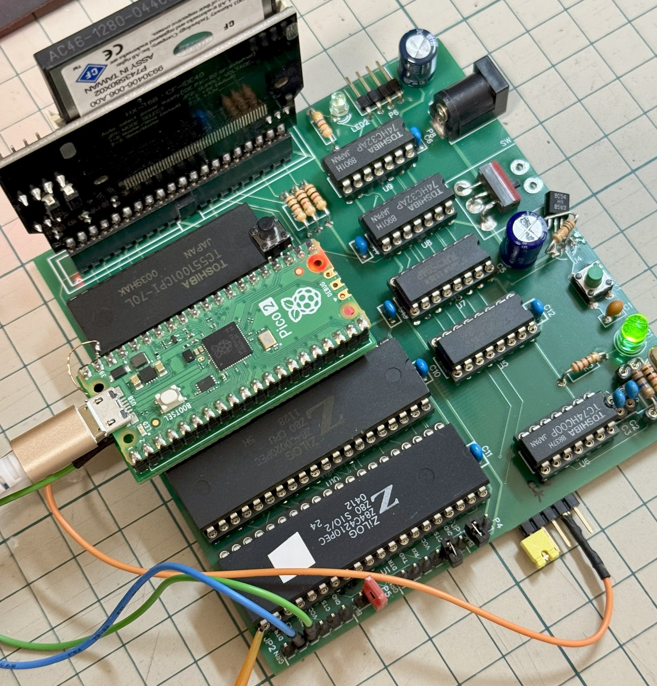

 # Pico2ROMEmu

This project is a simple and fast ROM emulator using Raspberry Pi Pico2.
[Japanese Readme](./README.md)

## Features
- The main component is just a Pico2, and it's fast! (Z80 10MHz, MC68HC000 12MHz no-wait)
- Dedicated for Raspberry Pi Pico2 (RP2350) and compatible boards.
- It has been confirmed to work with Super AKI-80, Tom's SBC (CP/M machine - Grant Searle), and 68k-nano.
- The Pico2 (3.3V power) is directly connected to a Z80/MC68000 based SBC (5V power).
- The ROM emulation is for a 27256 DIP-28 pin, but with an 8kByte capacity, for Super AKI-80 ROM-BASIC.
  - Supports 32KByte -> [32KB branch](https://github.com/kyo-ta04/Pico2ROMEmuBR/tree/32KB)
- It has reset output (open collector), clock output (20/12/10MHz), UART-USB conversion, and power supply (5V) functions.
- Super AKI-80 can be operated with minimal parts and no modifications, just with this one unit.
- This is an experimental project that also serves as training for RP2350's 5V tolerant, PIO, multi-core, UART-USB conversion, GPIO, etc.

## Structure
- KiCad circuit and board data is here -> [Pico2ROMEmu_PCB](https://github.com/kyo-ta04/Pico2ROMEmu_PCB)
- RP2350B Core Board (32KByte compatible) is here -> [Pico2ROMEmuCB](https://github.com/kyo-ta04/Pico2ROMEmuCB)
- Branches
  - [32KB](https://github.com/kyo-ta04/Pico2ROMEmuBR/tree/32KB) 32KByte extension, for Pico2/RP2350A_V10 CoreBoard
  - [68k-nano](https://github.com/kyo-ta04/Pico2ROMEmuBR/tree/68k-nano) MC68000 16bit, supports multiple ROM images
  - [develop](https://github.com/kyo-ta04/Pico2ROMEmuBR/tree/develop) For development
  - [test](https://github.com/kyo-ta04/Pico2ROMEmuBR/tree/test) For timing confirmation using sideset in PIO
  - [toms_sbc](https://github.com/kyo-ta04/Pico2ROMEmuBR/tree/toms_sbc) For Tom's SBC, Z80 CP/M support
- The ROM-BASIC part such as `rom_basic_const.c` is derived from [saki80basic](https://github.com/vintagechips/saki80basic).
  - The original [BASIC subset](http://searle.x10host.com/cpm/index.html) was created by Grant Searle, and was ported and improved for the Super AKI-80 by [@vintagechip (Dennou Densetsu)](https://vintagechips.wordpress.com/2025/04/24/saki80basic/).
- [Tom's SBC](https://oshwlab.com/peabody1929/CPM_Z80_Board_REV_B_copy-76313012f79945d3b8b9d3047368abf7) was created by peabody1929, and the ROM data is derived from [CP/M machine - Grant Searle](http://searle.x10host.com/cpm/index.html).
- [68k-nano](https://github.com/74hc595/68k-nano) was created and published by Matt Sarnoff (74hc595). The ROM data was generated from the source.
- The RP2350 PIO ROM emulation part is based on @tendai22plus's [ROM emulation](https://github.com/tendai22/emuz80_pico2/blob/main/doc/ROM_EMULATION.md) (in fact, it's almost the same 💦). Reference: [emuz80_pico2](https://github.com/tendai22/emuz80_pico2)

## Schematics and Documents
- Assembly instructions (note.com)
  - [How to assemble Pico2ROMEmu](https://note.com/quiet_duck4046/n/n425d6b7e8d55?sub_rt=share_sb) (Japanese)
  - [How to assemble Super AKI-80 (minimal parts version)](https://note.com/quiet_duck4046/n/n32906e1dfb96?sub_rt=share_sb) (Japanese)
- 
  - The above is an implementation example image of the RP2350A_V10 Core Board (32KByte compatible).
- 
  - The above is an implementation example image of the RP2350B Core Board (32KByte compatible).
- 
  - The above is an implementation example image of 68k-nano.
- 
  - The above is an implementation example image of Tom's SBC.
- 
  - The above is an implementation example image of Super AKI-80.
- 
  - The above is an implementation example image on a breadboard.
- 
  - The above is an image of the schematic.
- 
  - The above is an execution example image.

## For Developers: One-command build creation

Added a script to easily run configure and build:

Run in PowerShell:

```powershell
./scripts/build.ps1        # configure (if necessary) -> build
./scripts/build.ps1 -Clean # Delete and regenerate the build directory -> build
./scripts/build.ps1 -NoConfigure # Skip configure and only run build
```

The script uses the pico-sdk's ninja and configure scripts.

## License
- The source code of this project is under the MIT license.
- For the ROM data part, please refer to the respective licenses of the original sites and modified sources.

## Disclaimer
This software is provided as is. The author is not responsible for any damages.

## Acknowledgments
- Grant Searle ([author of the BASIC subset version/CP/M machine](http://searle.x10host.com/index.html))
- @vintagechip ([Dennou Densetsu, author of BASIC for Super AKI-80](https://vintagechips.wordpress.com/))
- @tendai22plus ([author of emuz80_pico2](https://github.com/tendai22/emuz80_pico2))
- peabody1929 ([author of Tom's SBC](https://oshwlab.com/peabody1929/works))
- Matt Sarnoff (74hc595) ([author of 68k-nano](https://github.com/74hc595/68k-nano))
- To everyone who gave advice, likes, and retweets, including @shippoiincho, @kondo_pc88, @TororoLab, @I_HaL, @antarcticlion, @GAPUX, @Tanuki_Bayashin, @applesorce, @W88DodPECuThLOl.
- The developers of the Raspberry Pi Pico SDK
- Everyone involved in this project

````