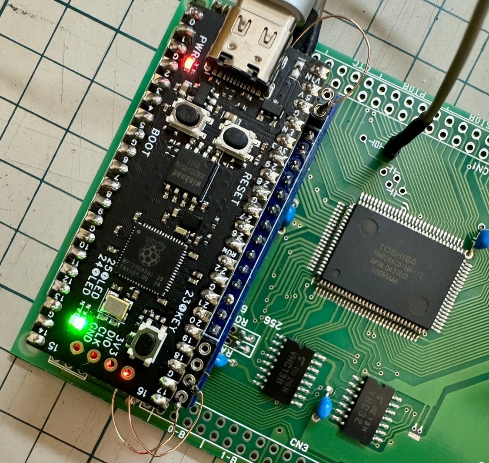
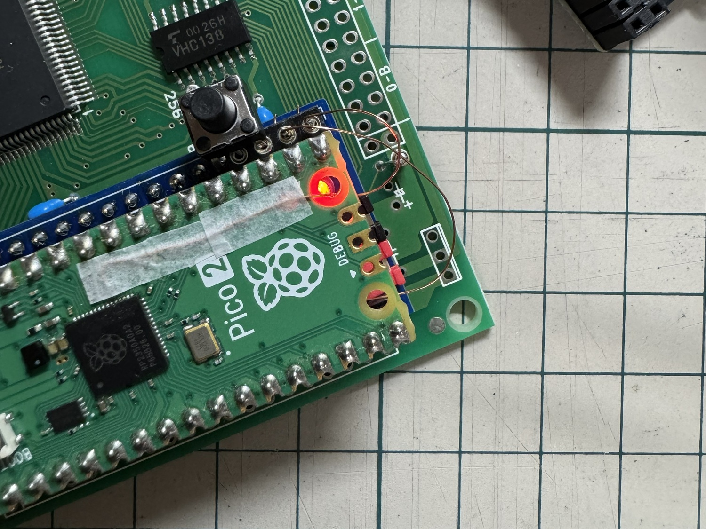
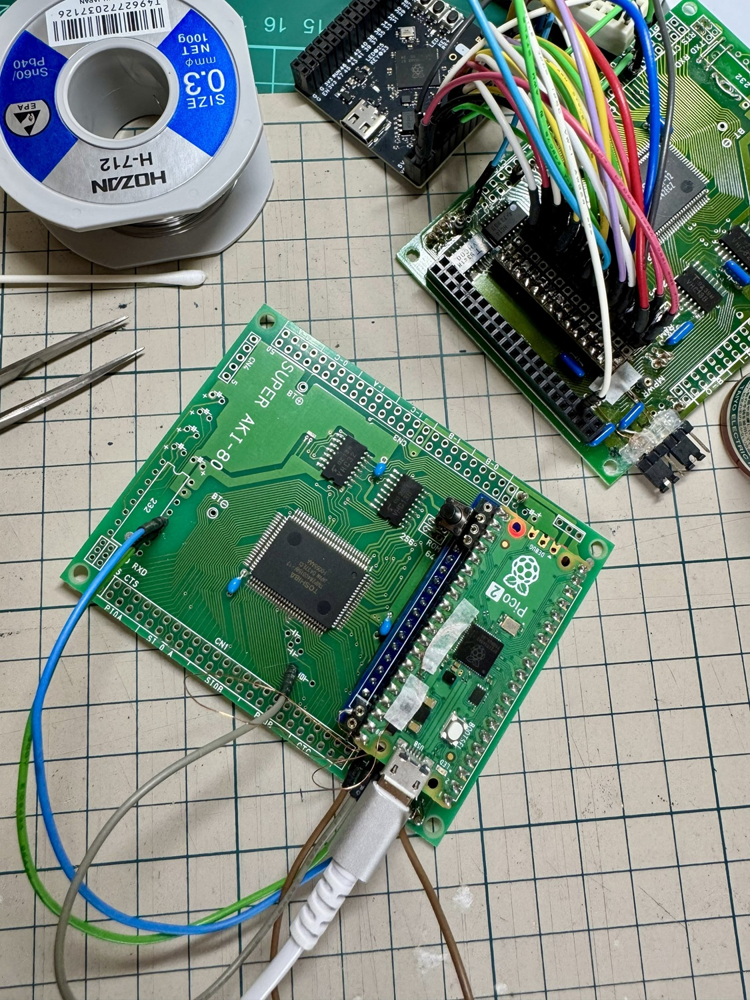
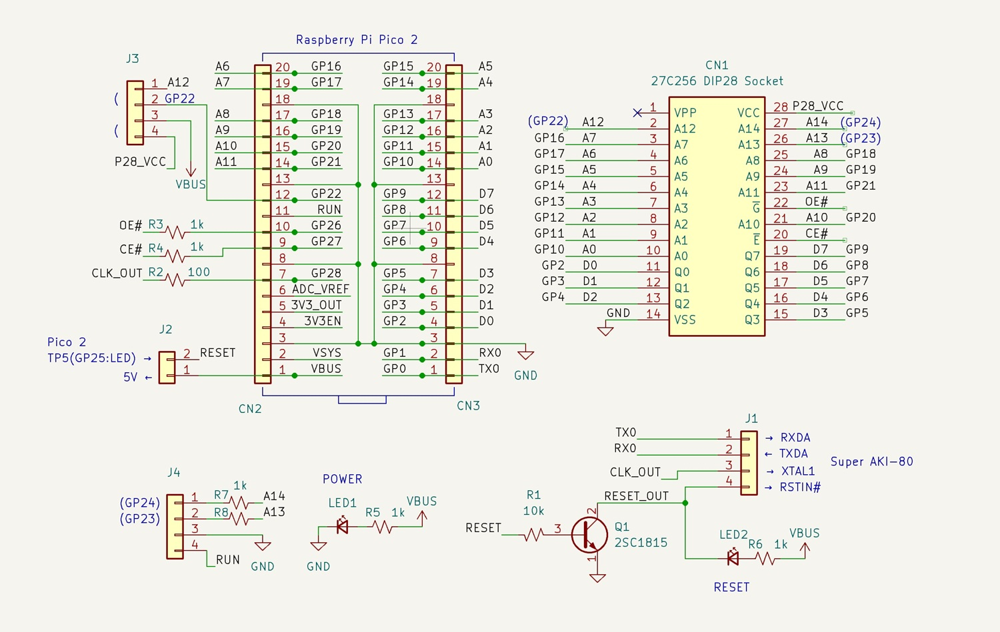
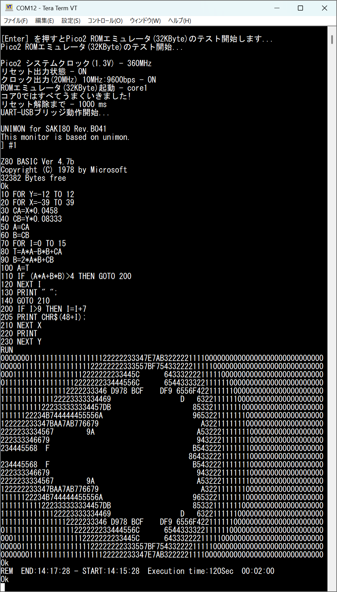

<!-- ```markdown -->
# Pico2ROMEmu 32KB

This project is a simple and fast ROM emulator using the Raspberry Pi Pico 2.
[Japanese Readme](./README.md)
## Features
- Pico2ROMEmu was originally limited to an 8KByte ROM capacity (addresses A0-A12) due to the limited number of available GPIOs on the Raspberry Pi Pico 2. However, by modifying the Pico 2 and the RP2350A_V10 CoreBoard, it has been expanded to 32KByte (addresses A0-A14).
- The WeAct Studio RP2350A_V10 CoreBoard is a low-cost development board compatible with the Raspberry Pi Pico 2. It features a USB Type-C connection, additional LEDs, a reset (RUN) switch, and high expandability by breaking out all GPIO pins.
Github -> [WeAct Studio RP2350A_V10 CoreBoard](https://github.com/WeActStudio/WeActStudio.RP2350ACoreBoard/tree/main/RP2350A_V10)
- For more details about Pico2ROMEmu, please see [Pico2ROMEmu](https://github.com/kyo-ta04/Pico2ROMEmuBR).

## Composition
- The ROM data parts, such as `saki80mon041_const.c`, are derived from [saki80mon041](https://github.com/yyhayami/saki80mon041).
UNIMON for SAKI80 is a port by @yyhayami of EMUZ80_Monitor Rev.B04, which was released for EMUZ80 with significant extensions by Aki.H based on the Universal Monitor published by asano, to run on the Super AKI-80.

## Schematics and Documents
- Assembly instructions (note.com)
  - [How to assemble Pico2ROMEmu](https://note.com/quiet_duck4046/n/n425d6b7e8d55?sub_rt=share_sb)
  - [How to assemble Super AKI-80 (minimal parts version)](https://note.com/quiet_duck4046/n/n32906e1dfb96?sub_rt=share_sb)

- 
- 
  - The above are implementation example images of the Raspberry Pi Pico 2 32KB modification.
- 
  - The above is an image of the schematic.
- 
- 
  - The above are execution example images.

## License
- The source code of this project is under the MIT License.
- For the ROM data parts, please refer to the licenses of the original sites and modified sources.

## Disclaimer
This software is provided "as is". The author is not responsible for any damages.

## Acknowledgements
- @yyhayami ([saki8iconst.c author](https://github.com/yyhayami/saki80mon041))
- @electrelic(asano) ([Universal Monitor author](https://electrelic.com/electrelic/node/1317))
- @akih_san(Aki.h) ([EMUZ80-MON author](https://github.com/akih-san/EMUZ80-MON))
- Everyone who gave advice, likes, and reposts on x.com etc.
- The developers of the Raspberry Pi Pico SDK
- Everyone involved in this project
- Please also see [Pico2ROMEmu](https://github.com/kyo-ta04/Pico2ROMEmuBR).

```
