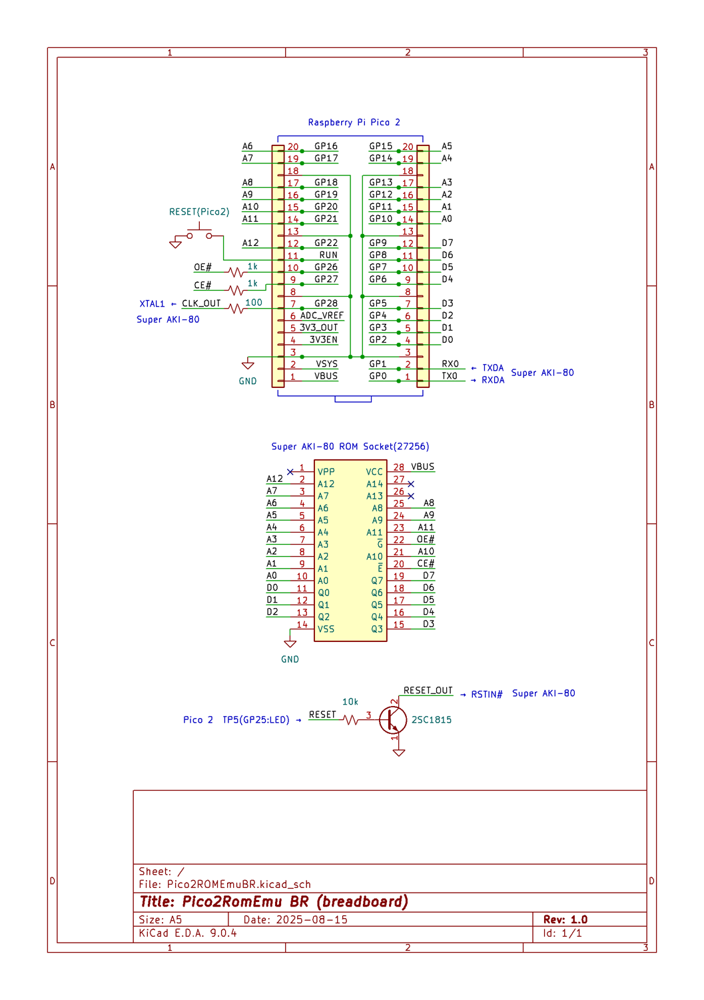

# Pico2ROMEmu

This project is a simple and fast ROM emulator using Raspberry Pi Pico2 (the binary is for Super AKI-80).

## Features
- The main component is just a Pico2, and it's fast (Z80 10MHz no wait states!).
- This is exclusively for Raspberry Pi Pico2 (RP2350), not for Pico (RP2040). Absolutely not.
- It's a crazy device that directly connects Pico2 (3.3v power) and Super AKI-80 (Z80-based SBC, 5v power). (If you don't understand what this means, please ask someone knowledgeable).
- ROM emulation is 8kByte, ROM-BASIC. It also has a reset output (open collector), clock output 20MHz (for TMPZ84C015: Z80 10MHz operation), UART-USB conversion, and power supply (5V) function.
- Super AKI-80 can be operated with this one unit with minimal parts and no modification.
- This is an experimental project that also serves as training for RP2350's PIO, multi-core, UART-USB conversion, GPIO, etc.
- A PCB has been created -> [Pico2ROMEmuPCB](./Pico2ROMEmuPCB/README.md)

## Structure
- The ROM-BASIC part such as `rom_basic_const.c` is derived from [saki80basic](https://vintagechips.wordpress.com/2025/04/24/saki80basic/).
  - The original [BASIC subset](http://searle.x10host.com/cpm/index.html) was created by Mr. Grant Searle, and was ported and improved for the Super AKI-80 by @vintagechip (Dennou Densetsu).
  - Please refer to the respective licenses for details.
- The RP2350 PIO ROM emulation part is based on @tendai22plus's [ROM emulation](https://github.com/tendai22/emuz80_pico2/blob/main/doc/ROM_EMULATION.md) (or rather, it's almost the same 💦).

## Schematics and Documents
- 
  - The above is an image of a breadboard implementation example.
- 
  - The above is an image of the schematic.
- 
  - The above is an image of an execution example.

## License
- The source code of this project is under the MIT license.
- For the ROM-BASIC part, please refer to the licenses of the original site and the modified source.

## Disclaimer
This software is provided as is. The author is not responsible for any damage.

## Acknowledgments
- Mr. Grant Searle (author of the BASIC subset version)
- @vintagechip (Dennou Densetsu) (author of BASIC for Super AKI-80)
- @tendai22plus (author of [emuz80_pico2](https://github.com/tendai22/emuz80_pico2))
- @shippoiincho, @kondo_pc88, @TororoLab, @I_HaL, @antarcticlion, @GAPUX, @Tanuki_Bayashin, @applesorce, @W88DodPECuThLOl, and everyone who gave advice, likes, and retweets.
- Raspberry Pi Pico SDK developers
- Everyone involved in this project

---

MIT License

Copyright (c) 2025 kyo-ta04(DragonballEZ)

Permission is hereby granted, free of charge, to any person obtaining a copy
of this software and associated documentation files (the "Software"), to deal
in the Software without restriction, including without limitation the rights
to use, copy, modify, merge, publish, distribute, sublicense, and/or sell
copies of the Software, and to permit persons to whom the Software is
furnished to do so, subject to the following conditions:

The above copyright notice and this permission notice shall be included in all
copies or substantial portions of the Software.

THE SOFTWARE IS PROVIDED "AS IS", WITHOUT WARRANTY OF ANY KIND, EXPRESS OR
IMPLIED, INCLUDING BUT NOT LIMITED TO THE WARRANTIES OF MERCHANTABILITY,
FITNESS FOR A PARTICULAR PURPOSE AND NONINFRINGEMENT. IN NO EVENT SHALL THE
AUTHORS OR COPYRIGHT HOLDERS BE LIABLE FOR ANY CLAIM, DAMAGES OR OTHER
LIABILITY, WHETHER IN AN ACTION OF CONTRACT, TORT OR OTHERWISE, ARISING FROM,
OUT OF OR IN CONNECTION WITH THE SOFTWARE OR THE USE OR OTHER DEALINGS IN THE
SOFTWARE.
