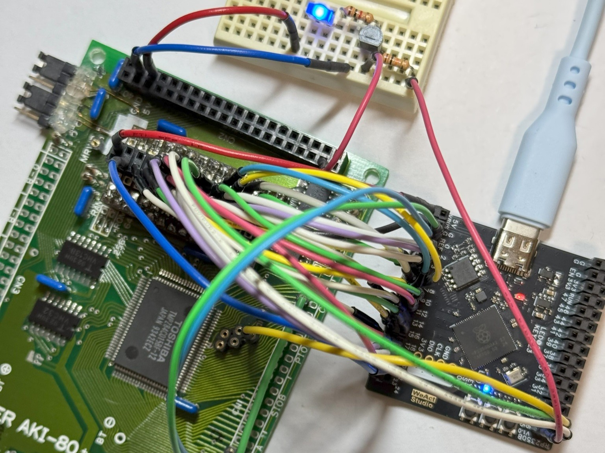
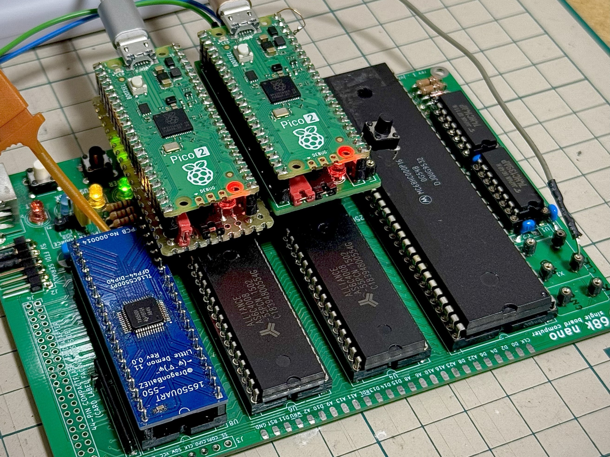
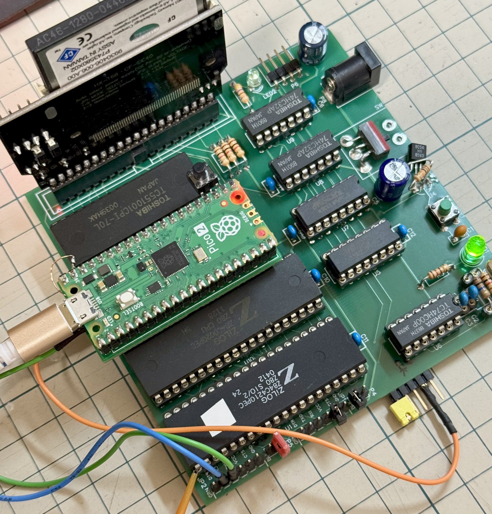
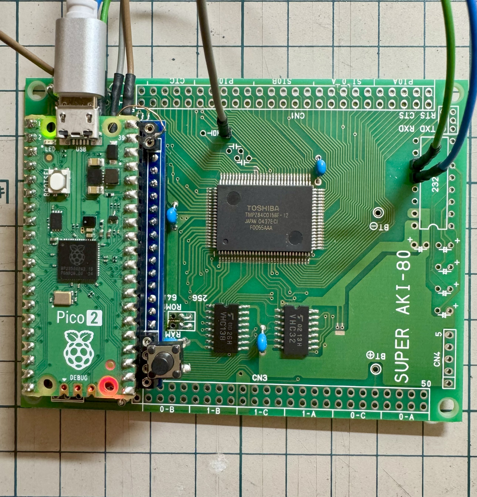

# Pico2ROMEmu

<!-- [Pico2ROMEmuBR](./IMG/Pico2ROMEmuPCB_68nano_img_2_1.jpg) -->
このプロジェクトは Raspberry Pi Pico2を使用した簡単で高速なROMエミュレータです   
[English Readme](./README.en.md)
## 特徴
- 主要部品はPico2だけ、そして高速！(Z80 10MHz, MC68HC000 12MHzノーウェイト)
- Raspberry Pi Pico2 (RP2350) 専用です。
- Super AKI-80、Tom's SBC(CP/M machine - Grant Searle)、68k-nanoで動作しました。
- Pico2(電源3.3V)と Z80/MC68000ベースの SBC(電源5V)を直結しています。
- ROMエミュレーションは27256 DIP-28ピンですが8kByte、ROM-BASIC(Super AKI-80のみ)。
- リセット出力(オープンコレクタ)、クロック出力 20/12/10MHz、UART-USB変換、電源供給(5V)機能あり。
- Super AKI-80は最小限の部品＆改造なし、これ一つだけで動作させることができます。
- RP2350のPIO、マルチコア、UART-USB変換、GPIO等のトレーニングを兼ねた実験的なプロジェクトです。

## 構成
- RP2350B Core Board版はこちら -> [Pico2ROMEmuCB](https://github.com/kyo-ta04/Pico2ROMEmuCB)
- 基板を作成しました -> [Pico2ROMEmuPCB](./Pico2ROMEmuPCB/README.md)
- [68k-nanoブランチはこちら](https://github.com/kyo-ta04/Pico2ROMEmuBR/tree/68k-nano)
- `rom_basic_const.c` などの ROM-BASIC 部分は [saki80basic](https://github.com/vintagechips/saki80basic) 由来です。
  - 元の[BASICサブセット](http://searle.x10host.com/cpm/index.html)は Grant Searle さんが作成したものであり、[Super AKI-80用に @vintagechip（電脳伝説）](https://vintagechips.wordpress.com/2025/04/24/saki80basic/)さんが移植・改良されています。
- [Tom's SBC](https://oshwlab.com/peabody1929/CPM_Z80_Board_REV_B_copy-76313012f79945d3b8b9d3047368abf7)はpeabody1929さんが作成したものであり、ROMデータは[CP/M machine - Grant Searle](http://searle.x10host.com/cpm/index.html) 由来です。
- [68k-nano](https://github.com/74hc595/68k-nano)は Matt Sarnoff(74hc595)さんが作成、公開されています。 ROMデータはソースから生成しました。
- RP2350 PIO ROMエミュレーション部分は @tendai22plus さんの [ROMエミュレーション](https://github.com/tendai22/emuz80_pico2/blob/main/doc/ROM_EMULATION.md) を参考にさせていただいてます(と言うかほぼいっしょ💦)　参考: [emuz80_pico2](https://github.com/tendai22/emuz80_pico2) 

## 回路図・資料
- [Pico2ROMEmuの組み立て方](https://note.com/quiet_duck4046/n/n425d6b7e8d55?sub_rt=share_sb)
- [Super AKI-80の組み立て方(最少部品編)](https://note.com/quiet_duck4046/n/n32906e1dfb96?sub_rt=share_sb)
- 
  - 上記は RP2350B Core Boardの実装例画像です。
- 
  - 上記は 68k-nanoの実装例画像です。
- 
  - 上記は Tom's SBCの実装例画像です。
- 
  - 上記は Super AKI-80の実装例画像です。
- 
  - 上記はブレッドボードの実装例画像です。
- 
  - 上記は回路図の画像です。
- 
  - 上記は実行例画像です。

## ライセンス
- 本プロジェクトのソースコードは MIT ライセンスです。
- ROMデータ部分は元サイトおよび改編元など、各々のライセンスを参照してください。

## 免責事項
本ソフトウェアは現状のまま提供されます。いかなる損害についても作者は責任を負いません。

## 謝辞
- Grant Searle さん（[BASICサブセット版/CP/M machine 作者）](http://searle.x10host.com/index.html)）
- @vintagechip さん（[電脳伝説さん Super AKI-80用BASIC 作者](https://vintagechips.wordpress.com/)）
- @tendai22plus さん ([emuz80_pico2  作者](https://github.com/tendai22/emuz80_pico2))
- peabody1929 さん ([Tom's SBC 作者](https://oshwlab.com/peabody1929/works))
- Matt Sarnoff(74hc595)さん ([68k-nano 作者](https://github.com/74hc595/68k-nano))
- @shippoiincho さん、 @kondo_pc88 さん、 @TororoLab さん、 @I_HaL さん、 @antarcticlion さん、 @GAPUX さん、 @Tanuki_Bayashin さん、 @applesorce さん、@W88DodPECuThLOl さんを始めとしたアドバイス、イイね、RPしていただいた皆様。
- Raspberry Pi Pico SDK 開発者の皆様
- 本プロジェクトに関わる全ての方々


## 開発者向け: ワンコマンドで build作成

簡単に configure と build を実行するスクリプトを追加しました:

PowerShell で実行:

```powershell
./scripts/build.ps1        # configure (必要なら) -> build
./scripts/build.ps1 -Clean # build ディレクトリを削除して再生成->build
./scripts/build.ps1 -NoConfigure # configure を飛ばしてビルドのみ実行
```

スクリプトは pico-sdk の ninja と configure スクリプトを利用します。
