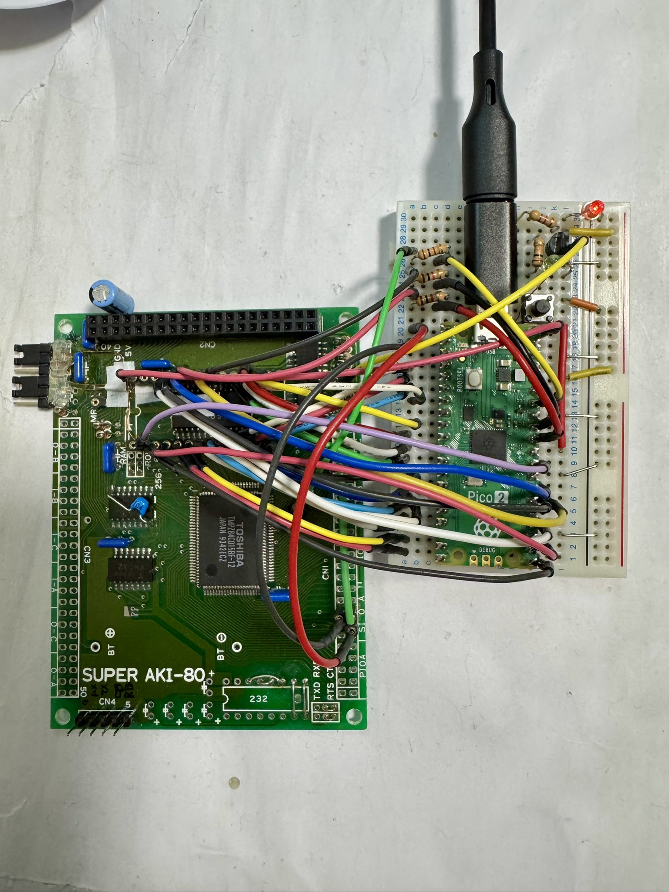

# Pico2ROMEmu

このプロジェクトは Super AKI-80用の Raspberry Pi Pico2を使用したROMエミュレータです。

## 構成
- `rom_basic_const.c` などの ROM-BASIC 部分は [saki80basic](https://vintagechips.wordpress.com/2025/04/24/saki80basic/) 由来です。
  - 元のBASICサブセットは Grant Searle 氏が作成したものであり、Super AKI-80用に @vintagechip（電脳伝説）さんが移植・改良されています。
  - 詳細は各々のライセンスを参照してください。

## 回路図・資料
- 
  - 上記は実装例画像です。
- [Pico2ROMEmuBR_sch.pdf](./Pico2ROMEmuBR_sch.pdf)
  - 上記PDFは回路図です。PDFビューアでご覧ください。

## ライセンス
- 本プロジェクトのソースコードは MIT ライセンスです。
- ROM-BASIC 部分は元サイトおよび改編元のライセンスを参照してください。

## 免責事項
本ソフトウェアは現状のまま提供されます。いかなる損害についても作者は責任を負いません。

## 謝辞
- Grant Searle 氏（BASICサブセット版作者）
- @vintagechip（電脳伝説）さん（Super AKI-80用BASIC作者）
- Raspberry Pi Pico SDK 開発者の皆様
- 本プロジェクトに関わる全ての方々

---

MIT License

Copyright (c) 2025 kyo-ta04(DragonballEZ)

Permission is hereby granted, free of charge, to any person obtaining a copy
of this software and associated documentation files (the "Software"), to deal
in the Software without restriction, including without limitation the rights
to use, copy, modify, merge, publish, distribute, sublicense, and/or sell
copies of the Software, and to permit persons to whom the Software is
furnished to do so, subject to the following conditions:

The above copyright notice and this permission notice shall be included in all
copies or substantial portions of the Software.

THE SOFTWARE IS PROVIDED "AS IS", WITHOUT WARRANTY OF ANY KIND, EXPRESS OR
IMPLIED, INCLUDING BUT NOT LIMITED TO THE WARRANTIES OF MERCHANTABILITY,
FITNESS FOR A PARTICULAR PURPOSE AND NONINFRINGEMENT. IN NO EVENT SHALL THE
AUTHORS OR COPYRIGHT HOLDERS BE LIABLE FOR ANY CLAIM, DAMAGES OR OTHER
LIABILITY, WHETHER IN AN ACTION OF CONTRACT, TORT OR OTHERWISE, ARISING FROM,
OUT OF OR IN CONNECTION WITH THE SOFTWARE OR THE USE OR OTHER DEALINGS IN THE
SOFTWARE.
