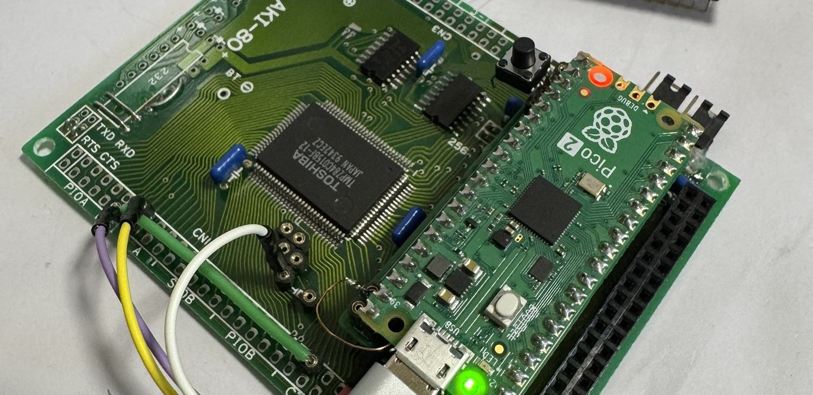
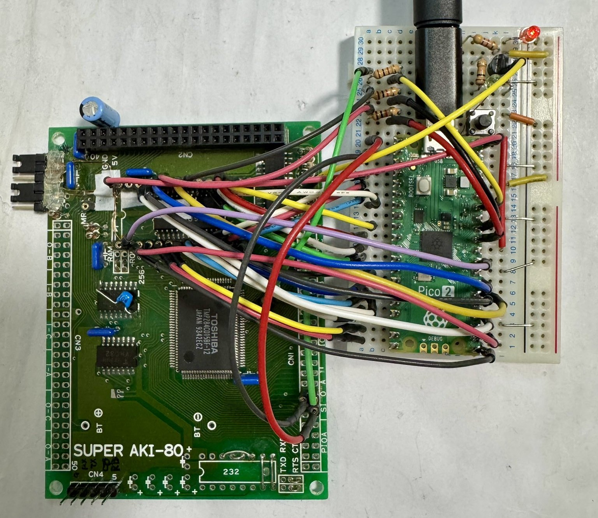
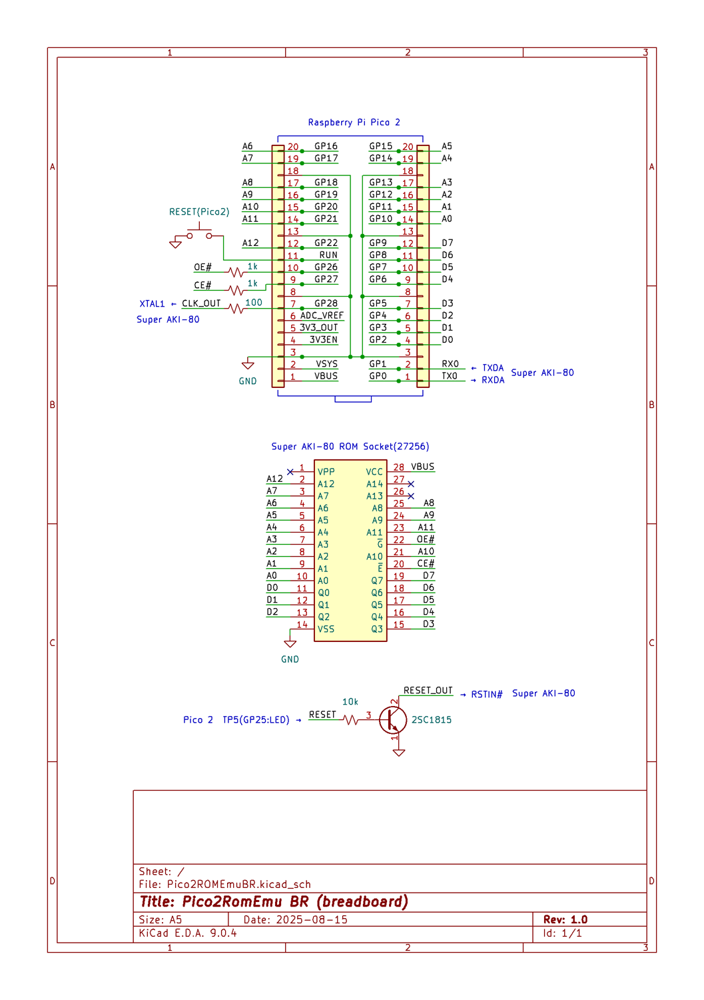
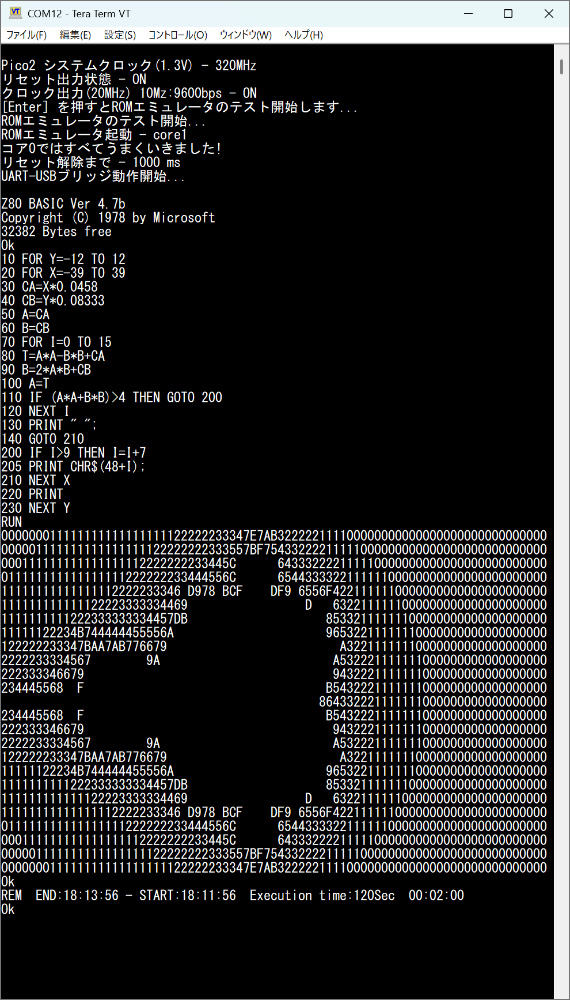

# Pico2ROMEmu

<!-- [Pico2ROMEmuBR](./IMG/Pico2ROMEmuPCB_68nano_img_2_1.jpg) -->
このプロジェクトは Raspberry Pi Pico2を使用した簡単で高速なROMエミュレータです   
[English Readme](./README.en.md)
## 特徴
- 主要部品はPico2だけ、そして高速(Z80 10MHz, MC68HC000 12MHzノーウェイト！)
- Raspberry Pi Pico2 (RP2350) 専用です、 Pico (RP2040) ダメ。　ゼッタイ。
- Pico2 (電源3.3v) と Super AKI-80/Tom's SBC/68k-nano (Z80/MC68000ベースの SBC、電源5v)を直結するヤバいヤツです。（意味が解らない人は詳しい人に聞いてね）
- ROMエミュレーションは8kByte、ROM-BASIC(Super AKI-80のみ)。
- リセット出力(オープンコレクタ)、クロック出力 20/12/10MHz、UART-USB変換、電源供給(5V)機能あり。
- Super AKI-80は最小限の部品＆改造なし、これ一つだけで動作させることができます。
- RP2350のPIO、マルチコア、UART-USB変換、GPIO等のトレーニングを兼ねた実験的なプロジェクトです。
- 基板を作成しました -> [Pico2ROMEmuPCB](./Pico2ROMEmuPCB/README.md)
- [68k-nanoブランチはこちら](https://github.com/kyo-ta04/Pico2ROMEmuBR/tree/68k-nano)

## 構成
- `rom_basic_const.c` などの ROM-BASIC 部分は [saki80basic](https://github.com/vintagechips/saki80basic) 由来です。
  - 元の[BASICサブセット](http://searle.x10host.com/cpm/index.html)は Grant Searle さんが作成したものであり、[Super AKI-80用に @vintagechip（電脳伝説）](https://vintagechips.wordpress.com/2025/04/24/saki80basic/)さんが移植・改良されています。
- [Tom's SBC](https://oshwlab.com/peabody1929/CPM_Z80_Board_REV_B_copy-76313012f79945d3b8b9d3047368abf7)はpeabody1929さんが作成したものであり、ROMデータは[CP/M machine - Grant Searle](http://searle.x10host.com/cpm/index.html) 由来です。
- [68k-nano](https://github.com/74hc595/68k-nano)は Matt Sarnoff(74hc595)さんが作成、公開されています。 ROMデータはソースから生成しました。
- RP2350 PIO ROMエミュレーション部分は @tendai22plus さんの [ROMエミュレーション](https://github.com/tendai22/emuz80_pico2/blob/main/doc/ROM_EMULATION.md) を参考にさせていただいてます(と言うかほぼいっしょ💦)　参考: [emuz80_pico2](https://github.com/tendai22/emuz80_pico2) 
- 詳細は各々のライセンスを参照してください。

## 回路図・資料
- 
  - 上記はブレッドボードの実装例画像です。
- 
  - 上記は回路図の画像です。
- 
  - 上記は実行例画像です。

## ライセンス
- 本プロジェクトのソースコードは MIT ライセンスです。
- ROMデータ部分は元サイトおよび改編元のライセンスを参照してください。

## 免責事項
本ソフトウェアは現状のまま提供されます。いかなる損害についても作者は責任を負いません。

## 謝辞
- Grant Searle さん（[BASICサブセット版/CP/M machine 作者）](http://searle.x10host.com/index.html)）
- @vintagechip さん（[電脳伝説さん Super AKI-80用BASIC 作者](https://vintagechips.wordpress.com/)）
- @tendai22plus さん ([emuz80_pico2  作者](https://github.com/tendai22/emuz80_pico2))
- peabody1929 さん ([Tom's SBC 作者](https://oshwlab.com/peabody1929/works))
- Matt Sarnoff(74hc595)さん ([68k-nano 作者](https://github.com/74hc595/68k-nano))
- @shippoiincho さん、 @kondo_pc88 さん、 @TororoLab さん、 @I_HaL さん、 @antarcticlion さん、 @GAPUX さん、 @Tanuki_Bayashin さん、 @applesorce さん、@W88DodPECuThLOl さんを始めとしたアドバイス、イイね、RPしていただいた皆様。
- Raspberry Pi Pico SDK 開発者の皆様
- 本プロジェクトに関わる全ての方々

---

MIT License

Copyright (c) 2025 kyo-ta04(DragonballEZ)

Permission is hereby granted, free of charge, to any person obtaining a copy
of this software and associated documentation files (the "Software"), to deal
in the Software without restriction, including without limitation the rights
to use, copy, modify, merge, publish, distribute, sublicense, and/or sell
copies of the Software, and to permit persons to whom the Software is
furnished to do so, subject to the following conditions:

The above copyright notice and this permission notice shall be included in all
copies or substantial portions of the Software.

THE SOFTWARE IS PROVIDED "AS IS", WITHOUT WARRANTY OF ANY KIND, EXPRESS OR
IMPLIED, INCLUDING BUT NOT LIMITED TO THE WARRANTIES OF MERCHANTABILITY,
FITNESS FOR A PARTICULAR PURPOSE AND NONINFRINGEMENT. IN NO EVENT SHALL THE
AUTHORS OR COPYRIGHT HOLDERS BE LIABLE FOR ANY CLAIM, DAMAGES OR OTHER
LIABILITY, WHETHER IN AN ACTION OF CONTRACT, TORT OR OTHERWISE, ARISING FROM,
OUT OF OR IN CONNECTION WITH THE SOFTWARE OR THE USE OR OTHER DEALINGS IN THE
SOFTWARE.
