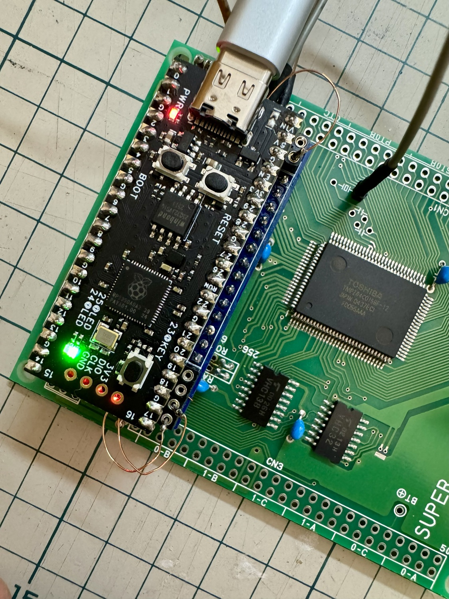
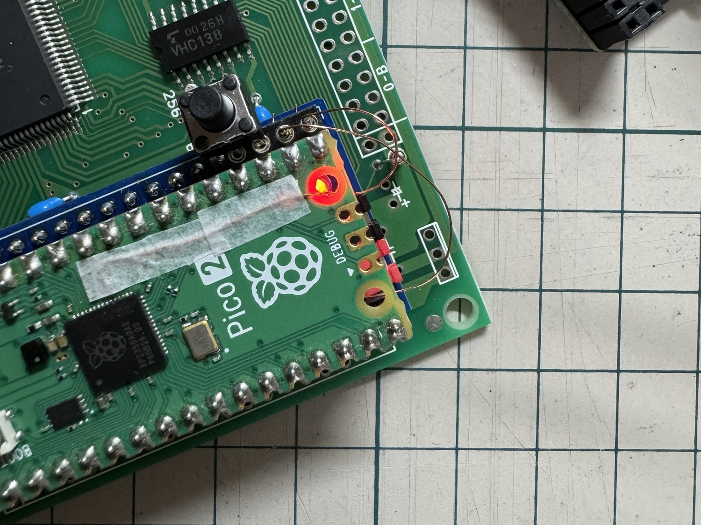
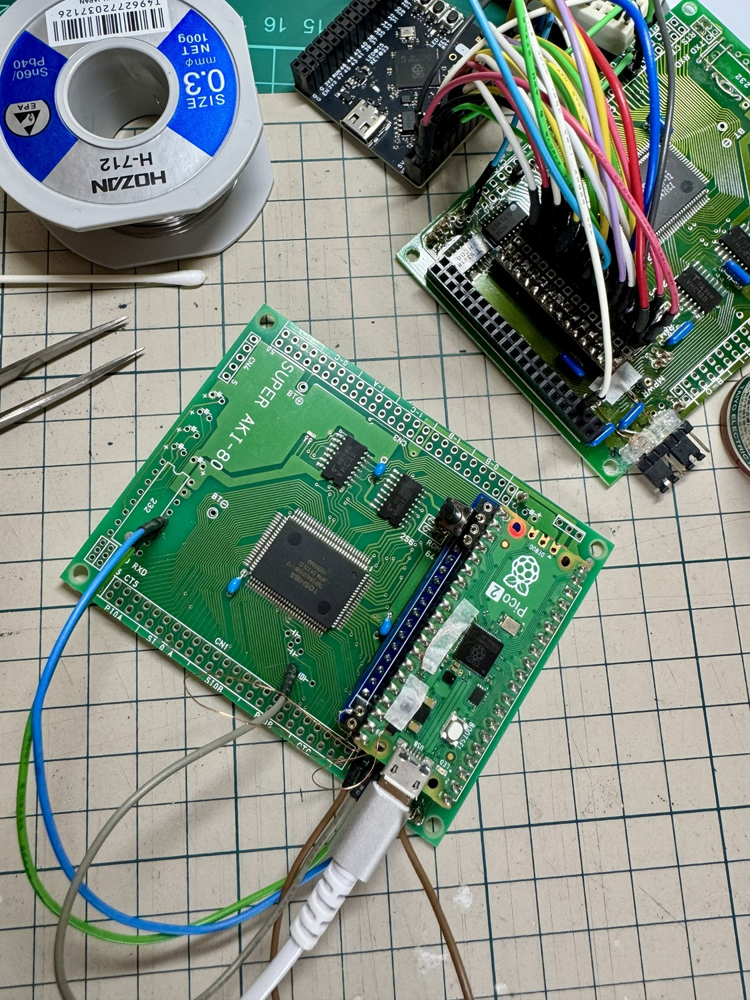
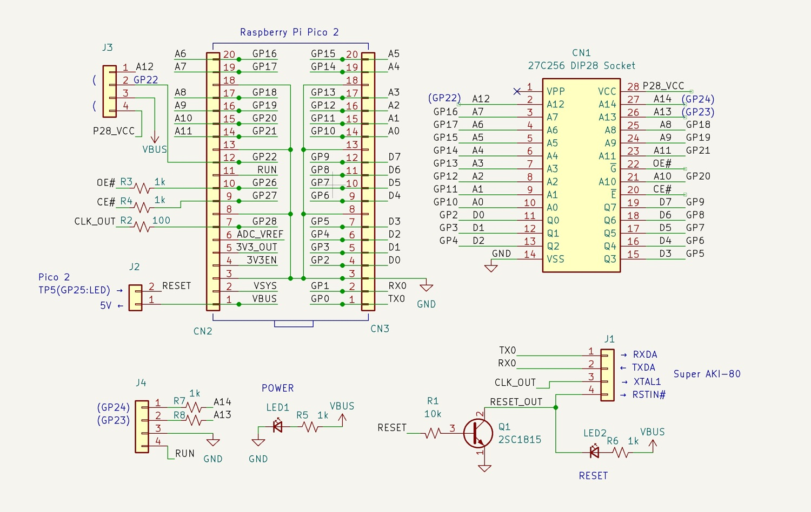
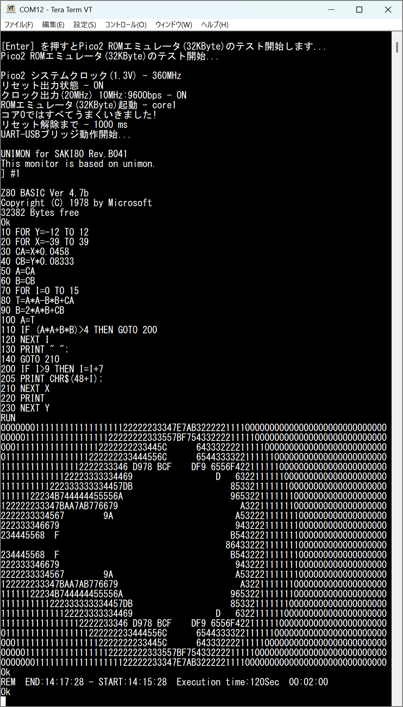
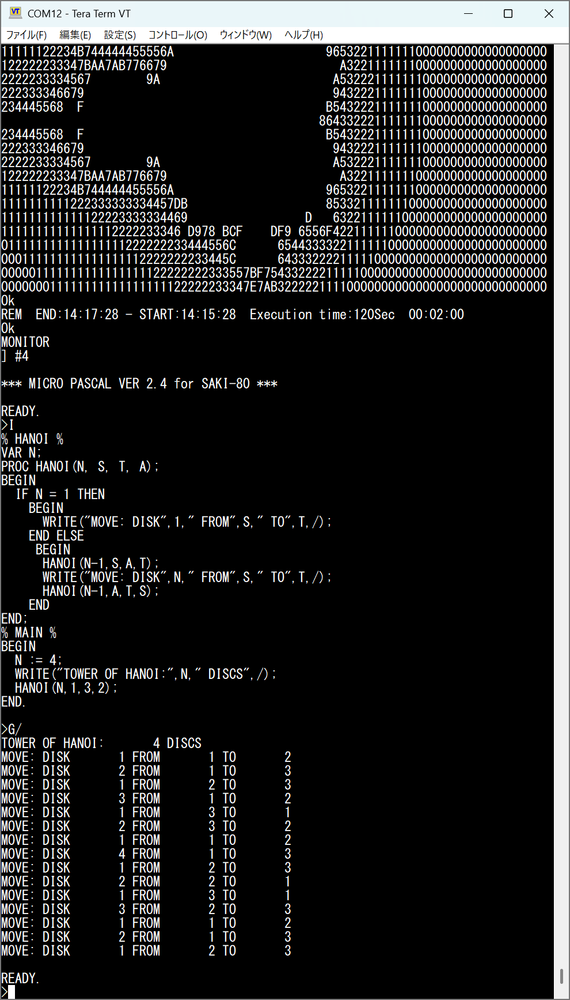

# Pico2ROMEmu 32KB

このプロジェクトは Raspberry Pi Pico2を使用した簡単で高速なROMエミュレータです   
[English Readme](./README.en.md)
## 特徴
- Pico2ROMEmuは Raspberry Pi Pico2で使用可能なGPIO数の制限からROM容量が 8KByte(アドレスA0～A12)でしたが、Pico2及びRP2350A_V10 CoreBoardを改造して32KByte(アドレスA0～A14)に拡張しました。
- WeAct StudioのRP2350A_V10 CoreBoardは Raspberry Pi Pico 2互換の低価格な開発ボード。USB Type-C接続や追加LED・リセット(RUN)SWを備え、GPIO全ピンを引き出せることによる拡張性などが特徴です。  
Github -> [WeAct Studio RP2350A_V10 CoreBoard](https://github.com/WeActStudio/WeActStudio.RP2350ACoreBoard/tree/main/RP2350A_V10)
- Pico2ROMEmuについて詳しくは[Pico2ROMEmu](https://github.com/kyo-ta04/Pico2ROMEmuBR)をご覧ください。

## 構成
- `saki80mon041_const.c` などの ROMデータ部分は [saki80mon041](https://github.com/yyhayami/saki80mon041) 由来です。  
UNIMON for SAKI80は、asano氏が公開されているUniversal MonitorをベースにAki.H氏による大幅な拡張がなされてEMUZ80用に公開されているEMUZ80_Monitor Rev.B04を @yyhayami氏が Super AKI-80 で動作するよう移植したものです。

## 回路図・資料
- 組み立て方の資料(not.com) 
  - [Pico2ROMEmuの組み立て方](https://note.com/quiet_duck4046/n/n425d6b7e8d55?sub_rt=share_sb)
  - [Super AKI-80の組み立て方(最少部品編)](https://note.com/quiet_duck4046/n/n32906e1dfb96?sub_rt=share_sb)  

- 
- 
  - 上記はRaspberry Pi Pico2 32KB改造の実装例画像です。
-   
  - 上記は回路図の画像です。
- 
- 
  - 上記は実行例画像です。

## ライセンス
- 本プロジェクトのソースコードは MIT ライセンスです。
- ROMデータ部分は元サイトおよび改編元など、各々のライセンスを参照してください。

## 免責事項
本ソフトウェアは現状のまま提供されます。いかなる損害についても作者は責任を負いません。

## 謝辞
- @yyhayamiさん（[saki80mon041 作者）](https://github.com/yyhayami/saki80mon041)）
- @electrelic(asano)さん（[Universal Monitor 作者）](https://electrelic.com/electrelic/node/1317)）
- @akih_san(Aki.h) さん（[EMUZ80-MON 作者](https://github.com/akih-san/EMUZ80-MON)）
- x.comなどでアドバイス、イイね、RPしていただいた皆様。
- Raspberry Pi Pico SDK 開発者の皆様
- 本プロジェクトに関わる全ての方々
- [Pico2ROMEmu](https://github.com/kyo-ta04/Pico2ROMEmuBR)もご覧ください。
