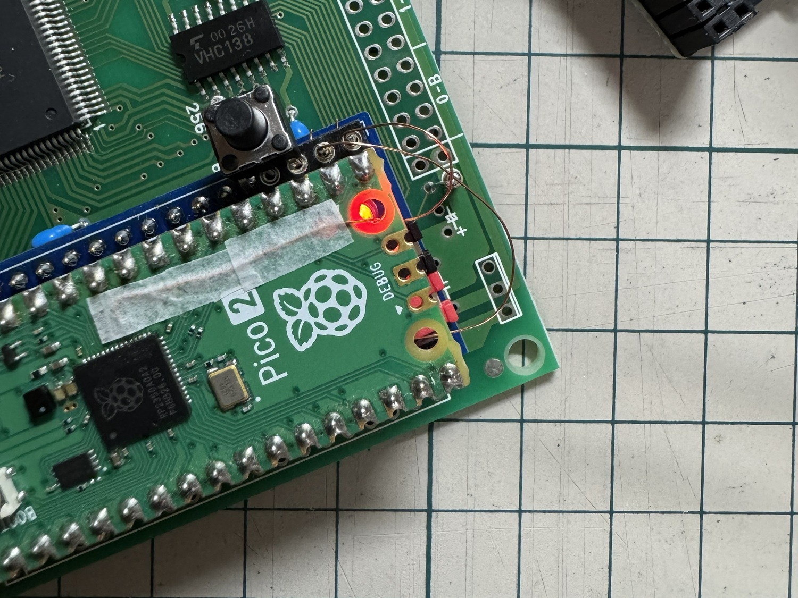
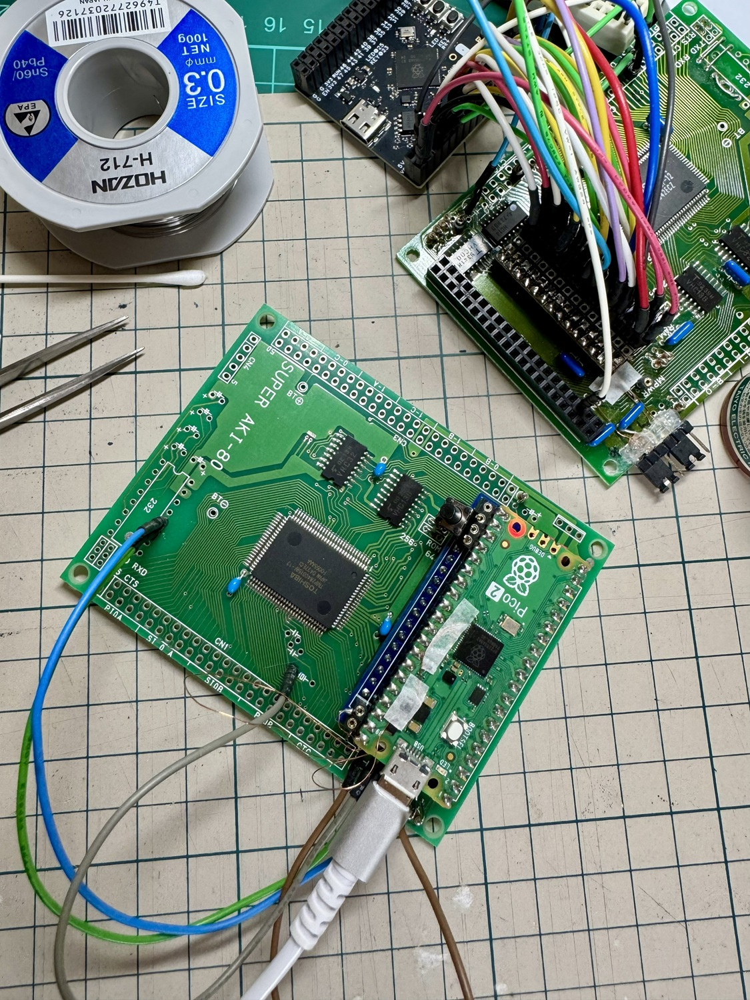
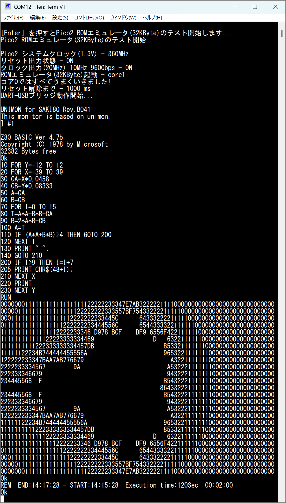
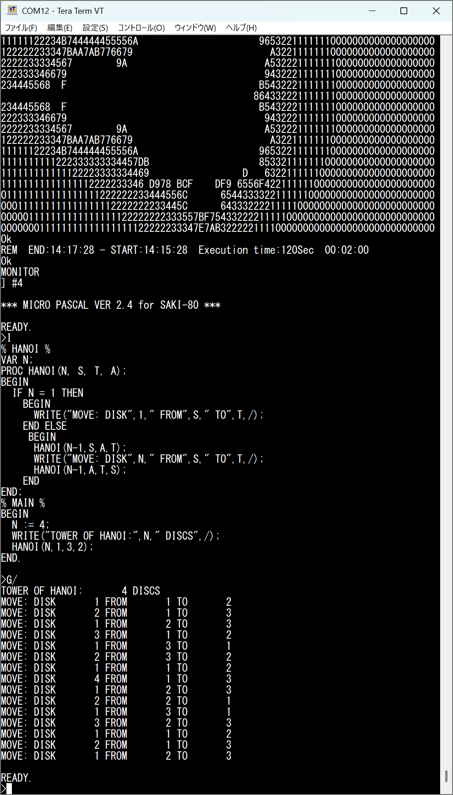

# Pico2ROMEmu - Tom's SBC 32KB

このプロジェクトは Raspberry Pi Pico2を使用した簡単で高速なROMエミュレータです。
[English Readme](./README.en.md)
## 特徴
- Pico2ROMEmuは Raspberry Pi Pico2で使用可能なGPIO数の制限からROM容量が 8KByte(アドレスA0～A12)でしたが、Pico2及びRP2350A_V10 CoreBoardを改造して32KByte(アドレスA0～A14)に拡張しました。
- WeAct StudioのRP2350A_V10 CoreBoardは Raspberry Pi Pico 2互換の低価格な開発ボード。USB Type-C接続や追加LED・リセット(RUN)SWを備え、GPIO全ピンを引き出せることによる拡張性などが特徴です。  
Github -> [WeAct Studio RP2350A_V10 CoreBoard](https://github.com/WeActStudio/WeActStudio.RP2350ACoreBoard/tree/main/RP2350A_V10)
- Pico2ROMEmuについて詳しくは[Pico2ROMEmu](https://github.com/kyo-ta04/Pico2ROMEmuBR)をご覧ください。

## 構成
- `rom_basic_const.c` などの ROM-BASIC 部分は [saki80basic](https://vintagechips.wordpress.com/2025/04/24/saki80basic/) 由来です。
  - 元の[BASICサブセット](http://searle.x10host.com/cpm/index.html)は Grant Searle 氏が作成したものであり、Super AKI-80用に @vintagechip（電脳伝説）さんが移植・改良されています。
  - 詳細は各々のライセンスを参照してください。
- RP2350 PIO ROMエミュレーション部分は @tendai22plus さんの [ROMエミュレーション](https://github.com/tendai22/emuz80_pico2/blob/main/doc/ROM_EMULATION.md) を参考にさせていただいてます(と言うかほぼいっしょ💦)

## 回路図・資料
- 組み立て方の資料(not.com) 
  - [Pico2ROMEmuの組み立て方](https://note.com/quiet_duck4046/n/n425d6b7e8d55?sub_rt=share_sb)
  - [Super AKI-80の組み立て方(最少部品編)](https://note.com/quiet_duck4046/n/n32906e1dfb96?sub_rt=share_sb)  

- 
- 
  - 上記はRaspberry Pi Pico2 32KB改造の実装例画像です。
-   
  - 上記は回路図の画像です。
- 
- 
  - 上記は実行例画像です。

## ライセンス
- 本プロジェクトのソースコードは MIT ライセンスです。
- ROMデータ部分は元サイトおよび改編元など、各々のライセンスを参照してください。

## 免責事項
本ソフトウェアは現状のまま提供されます。いかなる損害についても作者は責任を負いません。

## 謝辞
- Grant Searle 氏（BASICサブセット版作者）
- @shippoiincho さん、 @kondo_pc88 さん、 @TororoLab さん、 @I_HaL さん、 @antarcticlion さん、 @GAPUX さん、 @Tanuki_Bayashin さん、 @applesorce さん、@W88DodPECuThLOl さんを始めとしたアドバイス、イイね、RPしていただいた皆様。
- Raspberry Pi Pico SDK 開発者の皆様
- 本プロジェクトに関わる全ての方々
- [Pico2ROMEmu](https://github.com/kyo-ta04/Pico2ROMEmuBR)もご覧ください。
