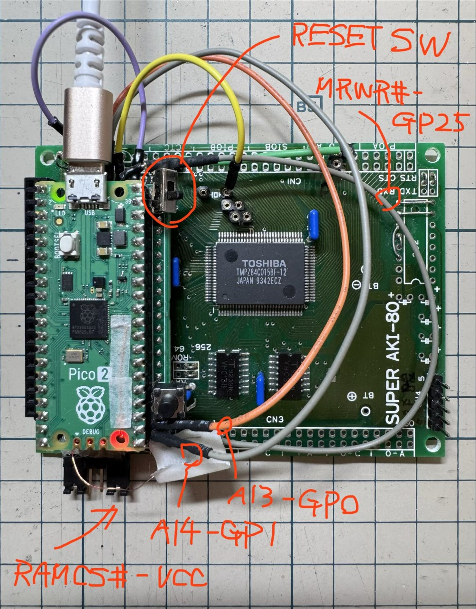
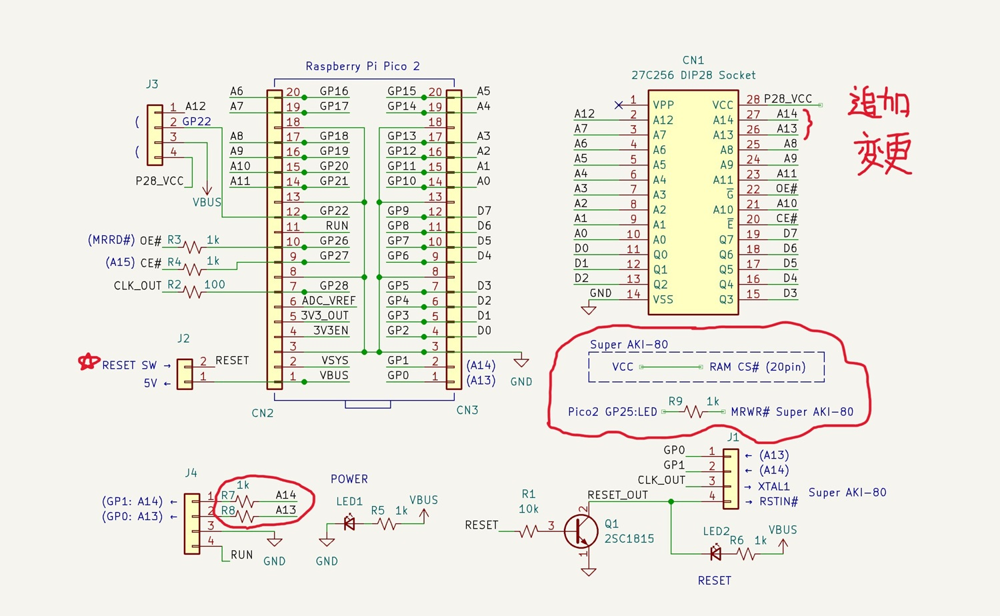
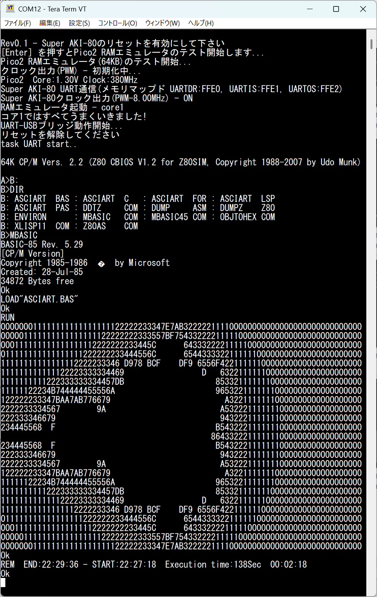

# Pico2ROMEmu (SuperAKI80 CP/M 64K RAMEmu)

このプロジェクトは [Pico2ROMEmu](https://github.com/kyo-ta04/Pico2ROMEmuBR) を改造し、64KB RAM及びメモリマップドI/OのUARTエミュレーションで CP/M v2.2を動かすものです。

## 特徴
- Raspberry Pi Pico2 追加GPIO引出し無し（GPIO25のみ）、使用GPIOは26+1ピン。
- RAMは 64KB全て Pico2のエミュレーション（要Super AKI-80基板上のSRAM無効化とMRWR接続）。
- UARTエミュレーションは メモリマップドI/O使用。
- リセットは手動、（要リセットSW）

## 構成
- KiCad 回路・基板データはこちら -> [Pico2ROMEmu_PCB](https://github.com/kyo-ta04/Pico2ROMEmu_PCB)
- `emubasic.c` などの ROM-BASIC 部分は [emuz80](https://github.com/vintagechips/emuz80) 由来です。
  - 元の[BASICサブセット](http://searle.x10host.com/cpm/index.html)は Grant Searle さんが作成したものであり、[EMUZ80用に @vintagechip（電脳伝説）](https://vintagechips.wordpress.com/2022/03/05/emuz80_reference/)さんが移植・改良されています。
- RP2350 PIO ROMエミュレーション部分は @tendai22plus さんの [ROMエミュレーション](https://github.com/tendai22/emuz80_pico2/blob/main/doc/ROM_EMULATION.md) を参考にさせていただいてます。　参考: [emuz80_pico2](https://github.com/tendai22/emuz80_pico2) 

## 回路図・資料
- 組み立て方の資料(not.com) 
  - [Pico2ROMEmuの組み立て方](https://note.com/quiet_duck4046/n/n425d6b7e8d55?sub_rt=share_sb)
  - [Super AKI-80の組み立て方(最少部品編)](https://note.com/quiet_duck4046/n/n32906e1dfb96?sub_rt=share_sb)  
- 
  - 上記は回路図の画像です。
- 
  - 上記は実行例画像です。

## ライセンス
- 本プロジェクトのソースコードは MIT ライセンスです。
- ROMデータ部分は元サイトおよび改編元など、各々のライセンスを参照してください。

## 免責事項
本ソフトウェアは現状のまま提供されます。いかなる損害についても作者は責任を負いません。

## 謝辞
- Grant Searle さん（[BASICサブセット版/CP/M machine 作者）](http://searle.x10host.com/index.html)）
- @vintagechip さん（[電脳伝説さん Super AKI-80用BASIC 作者](https://vintagechips.wordpress.com/)）
- @tendai22plus さん ([emuz80_pico2  作者](https://github.com/tendai22/emuz80_pico2))
- Raspberry Pi Pico SDK 開発者の皆様
- 本プロジェクトに関わる全ての方々
