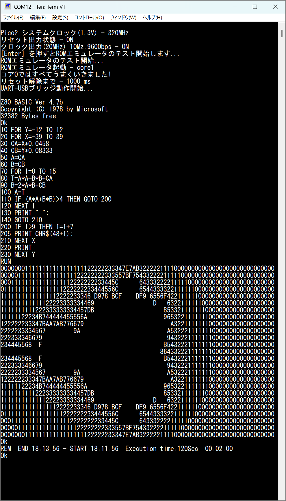

# Pico2ROMEmu - Tom's SBC

このプロジェクトは Raspberry Pi Pico2を使用した簡単で高速なROMエミュレータです。
[English Readme](./README.en.md)
## 特徴

## 構成
- `rom_basic_const.c` などの ROM-BASIC 部分は [saki80basic](https://vintagechips.wordpress.com/2025/04/24/saki80basic/) 由来です。
  - 元の[BASICサブセット](http://searle.x10host.com/cpm/index.html)は Grant Searle 氏が作成したものであり、Super AKI-80用に @vintagechip（電脳伝説）さんが移植・改良されています。

## 回路図・資料
- 
  - 上記は実行例画像です。

## ライセンス
- 本プロジェクトのソースコードは MIT ライセンスです。
- ROM-BASIC 部分は元サイトおよび改編元のライセンスを参照してください。

## 免責事項
本ソフトウェアは現状のまま提供されます。いかなる損害についても作者は責任を負いません。

## 謝辞
- Grant Searle 氏（BASICサブセット版作者）
- @shippoiincho さん、 @kondo_pc88 さん、 @TororoLab さん、 @I_HaL さん、 @antarcticlion さん、 @GAPUX さん、 @Tanuki_Bayashin さん、 @applesorce さん、@W88DodPECuThLOl さんを始めとしたアドバイス、イイね、RPしていただいた皆様。
- Raspberry Pi Pico SDK 開発者の皆様
- 本プロジェクトに関わる全ての方々
