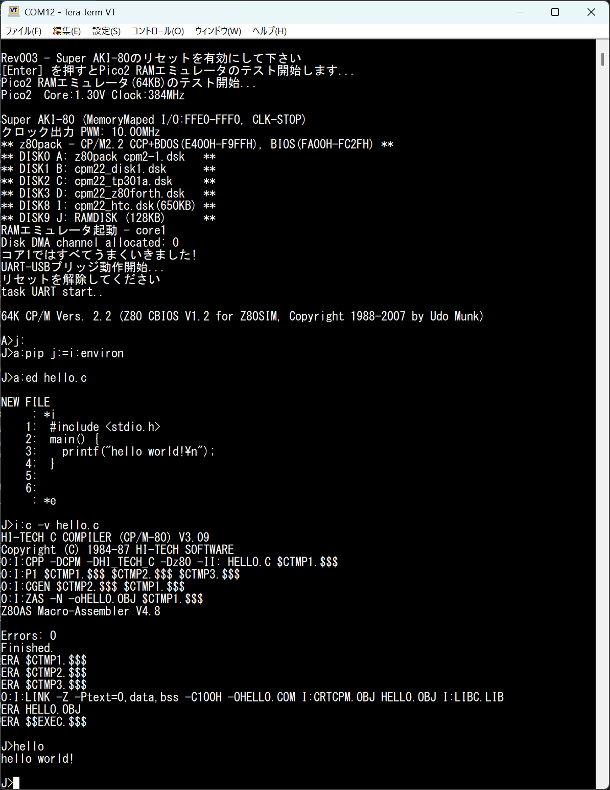

# Pico2ROMEmu (SuperAKI80 CP/M 64K RAMEmu)

このプロジェクトは [Pico2ROMEmu](https://github.com/kyo-ta04/Pico2ROMEmuBR) を改造し、SuperAKI80上で64KB RAM及びメモリマップドI/OのUART及びROM/RAMディスクエミュレーションで CP/M v2.2を動かすものです。

## 特徴
- Raspberry Pi Pico2 追加GPIO引出し無し（GPIO25のみ）、使用GPIOは26+1ピン。
- RAMは 64KB全て Pico2のエミュレーション（要Super AKI-80基板上のSRAM無効化とMRWR接続）。
- UART及びROM/RAMディスクエミュレーションは メモリマップドI/Oを使用。
- リセットは手動、（要リセットSW）。
- ファームウェアは EMUZ80_RP2040_PCB_Firmwareを元にしています、詳しくはこちらをどうぞ  
 -> [EMUZ80_RP2040_PCB_Firmware AE-2040_CPMブランチ](https://github.com/kyo-ta04/EMUZ80_RP2040_PCB_Firmware/tree/AE-2040_CPM)

## 構成
- KiCad 回路・基板データはこちら -> [Pico2ROMEmu_PCB](https://github.com/kyo-ta04/Pico2ROMEmu_PCB)
- CP/M 関係は z80pack、Z80-MBC2、The Unofficial CP/M Web site 等を元にしています。
    - z80pack - [unix4fun](http://cpmarchives.classiccmp.org/cpm/mirrors/www.autometer.de/unix4fun/z80pack/index.html), 
    [github](https://github.com/udo-munk/z80pack)
    - Z80-MBC2 - [Hackaday.io](https://hackaday.io/project/159973-z80-mbc2-a-4-ics-homebrew-z80-computer),
    [github](https://github.com/z80-mbc2/Z80-MBC2)
    - The Unofficial CP/M Web site - [cpm.z80.de](http://www.cpm.z80.de/)
- Super AKI-80(Z80) バスエミュレーションは EMUZ80、 emuz80_pico2等を参考にさせていただいてます。
    - EMUZ80 （@vintagechips氏作）- [電脳伝説ブログ](https://vintagechips.wordpress.com/2022/03/05/emuz80_reference/), 
    [github](https://github.com/jCW299/emuz80) 
    - emuz80_pico2（@tendai22plus氏作） - [github](https://github.com/tendai22/emuz80_pico2)
- Super AKI-80
    - 秋月電子 - [スーパーAKI-80 (基板単体、保守部品)](https://akizukidenshi.com/catalog/g/g111324/)

## 回路図・資料
- 組み立て方の資料(not.com) 
  - [Pico2ROMEmuの組み立て方](https://note.com/quiet_duck4046/n/n425d6b7e8d55?sub_rt=share_sb)
  - [Super AKI-80の組み立て方(最少部品編)](https://note.com/quiet_duck4046/n/n32906e1dfb96?sub_rt=share_sb)  
- 
  - 上記は回路図の画像です。
- 
  - 上記は実行例画像です。
- 
  - 上記は実行例画像です。

## ライセンス
- 本プロジェクトのソースコードは MIT ライセンスです。
- ROMデータ部分は元サイトおよび改編元など、各々のライセンスを参照してください。
- CP/Mその他に関してはこちらをご覧ください [EMUZ80_RP2040_PCB_Firmware AE-2040_CPMブランチ](https://github.com/kyo-ta04/EMUZ80_RP2040_PCB_Firmware/tree/AE-2040_CPM)

## 免責事項
本ソフトウェアは現状のまま提供されます。いかなる損害についても作者は責任を負いません。

## 謝辞
- Grant Searle さん（[BASICサブセット版/CP/M machine 作者）](http://searle.x10host.com/index.html)）
- @vintagechip さん（[電脳伝説さん Super AKI-80用BASIC 作者](https://vintagechips.wordpress.com/)）
- @tendai22plus さん ([emuz80_pico2  作者](https://github.com/tendai22/emuz80_pico2))
- Raspberry Pi Pico SDK 開発者の皆様
- 本プロジェクトに関わる全ての方々
