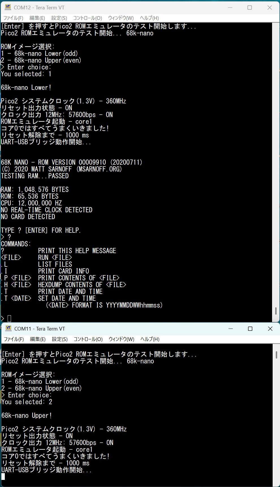

# Pico2ROMEmu 68k-nano

このプロジェクトは Raspberry Pi Pico2を使用した簡単で高速なROMエミュレータです   
[English Readme](./README.en.md)
## 特徴
- Pico2ROMEmuを2台使用して 16bit(27C256 x2) MC68HC000 12MHzの 68k-nanogが動作しました。
- 起動時にLower(下位)/Upper(上位)バイトのROMイメージを選択できます。
- Pico2ROMEmuについて詳しくは[Pico2ROMEmu](https://github.com/kyo-ta04/Pico2ROMEmuBR)をご覧ください。

## 構成
- [68k-nano](https://github.com/74hc595/68k-nano)は Matt Sarnoff(74hc595)さんが作成、公開されています。
  - フォークして ROMデータやガーバーなどを追加 -> [kyo-ta04: 68k-nano](https://github.com/kyo-ta04/68k-nano)

## 回路図・資料
- 
  - 上記は実行例画像です。

## ライセンス
- 本プロジェクトのソースコードは MIT ライセンスです。
- ROMデータ部分などは元サイトおよび改編元のライセンスを参照してください。

## 免責事項
本ソフトウェアは現状のまま提供されます。いかなる損害についても作者は責任を負いません。

## 謝辞
- Matt Sarnoff(74hc595)さん ([68k-nano 作者](https://github.com/74hc595/68k-nano))
- Raspberry Pi Pico SDK 開発者の皆様
- 本プロジェクトに関わる全ての方々
- [Pico2ROMEmu](https://github.com/kyo-ta04/Pico2ROMEmuBR)もご覧ください。

